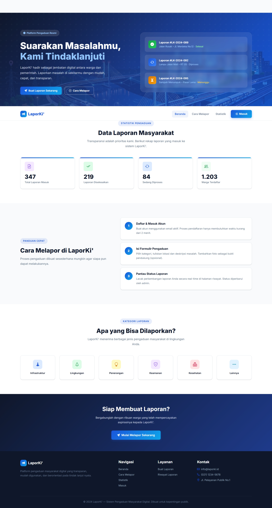
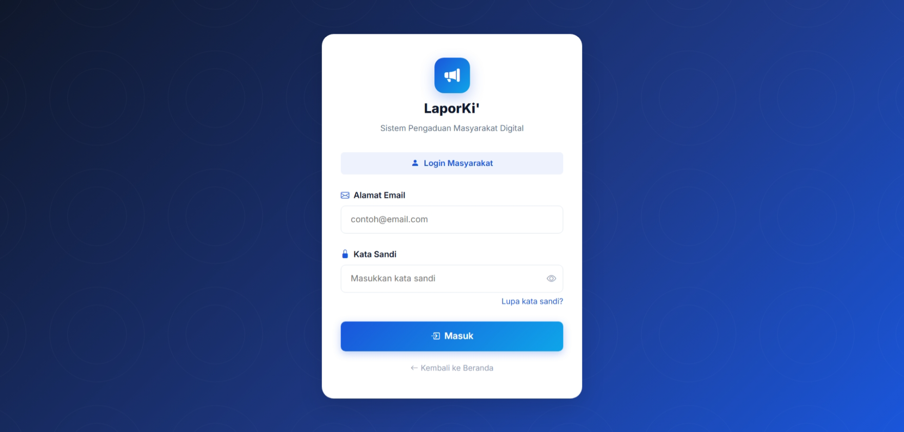
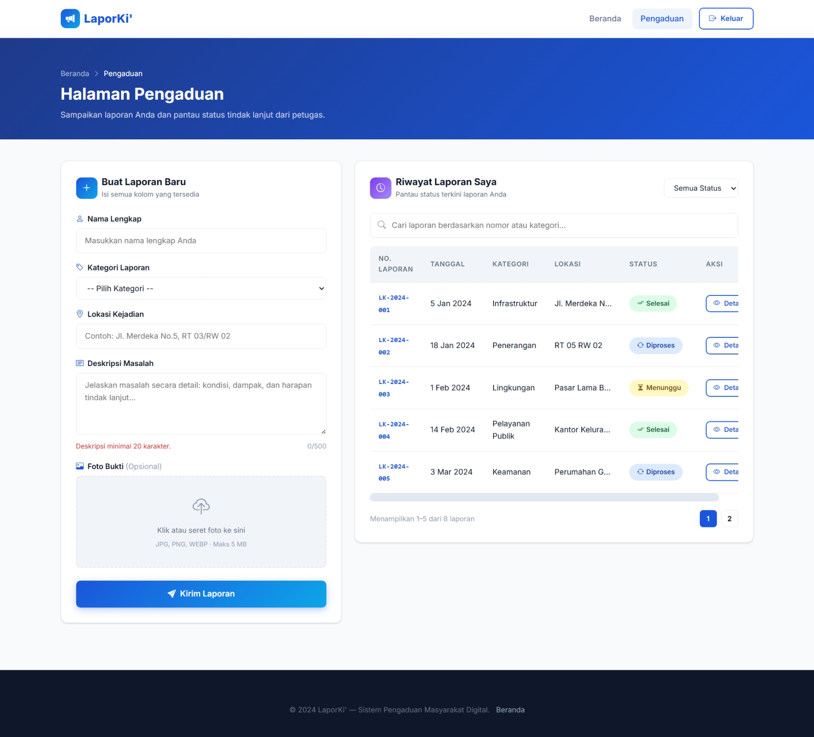

# LaporKi - Sistem Layanan Pengaduan Masyarakat

LaporKi adalah platform berbasis web yang dirancang untuk memudahkan masyarakat dalam menyampaikan pengaduan atau laporan terkait berbagai masalah yang terjadi di lingkungan sekitar. Platform ini bertujuan untuk menjembatani komunikasi antara masyarakat dan pihak berwenang dengan cara yang lebih transparan, cepat, dan efisien.

## Fitur Utama

- **Landing Page**: Halaman informasi publik mengenai cara kerja sistem LaporKi, panduan, dan informasi umum.
- **Sistem Autentikasi**: Fitur login bagi pengguna terdaftar untuk mengakses layanan pengaduan.
- **Manajemen Pengaduan**: Halaman khusus bagi masyarakat untuk mengisi detail laporan, melampirkan bukti foto, dan melihat daftar laporan yang telah dikirim beserta statusnya.
- **Desain Responsif**: Antarmuka yang ramah pengguna (UI/UX) dan dapat menyesuaikan dengan berbagai ukuran layar, baik di komputer, tablet, maupun perangkat seluler.

## Teknologi yang Digunakan

- **Markup & Styling**: HTML5, CSS3
- **Framework CSS**: Bootstrap 5.3
- **Interaktivitas**: JavaScript (Vanilla & jQuery 3.7)

## Tangkapan Layar (Screenshots)

Berikut adalah tampilan antarmuka dari sistem LaporKi. *(Silakan ganti teks dalam kurung dengan link/path gambar yang sesuai)*

### 1. Halaman Utama (Landing Page)
> Halaman awal yang memberikan informasi mengenai layanan LaporKi kepada masyarakat umum.

### 2. Halaman Masuk (Login Page)
> Halaman autentikasi bagi pengguna sebelum dapat membuat atau melacak laporan.

### 3. Halaman Pengaduan (Pengaduan Page)
> Halaman dasbor masyarakat untuk membuat laporan baru, mengunggah foto bukti, dan memantau status laporan yang ada.

## Cara Menjalankan Proyek (Local Development)

1. Clone atau unduh repositori proyek ini ke komputer Anda.
2. Pastikan Anda memiliki browser modern (seperti Google Chrome, Mozilla Firefox, atau Microsoft Edge).
3. Buka folder proyek, lalu jalankan file `index.html` dengan cara klik ganda (double click) atau drag-and-drop ke dalam jendela browser.
4. (Opsional namun disarankan) Gunakan ekstensi seperti **Live Server** di Visual Studio Code untuk pengalaman pengembangan yang lebih baik.
